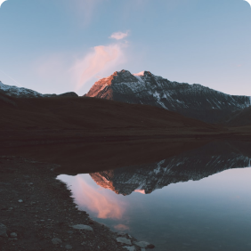

# Project 3: Around The U.S.

This project is an adaptive webpage, that is suitable for screen resolution 320px and upwards.

### Overview

- Intro
- Figma
- Images

**Intro**

This project is made so all the elements are displayed correctly on popular screen sizes. We recommend investing more time in completing this project, since it's more difficult than previous ones.

**Figma**

- [Link to the project on Figma](https://www.figma.com/file/ii4xxsJ0ghevUOcssTlHZv/Sprint-3%3A-Around-the-US?node-id=0%3A1)

**Images**

